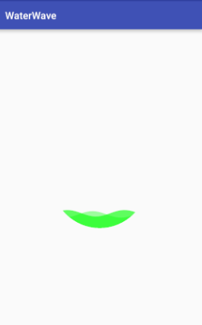

WaterWave
==
水波动画- 动画和页面生命周期绑定



使用方式
--
1) 导入包
  
   ```gradle
   
      compile 'com.jktaihe:water-wave:1.0.0'
   
   ``` 


2) xml中使用


      <com.jktaihe.wwview.WaterWaveView
            android:id="@+id/wwv"
            android:layout_width="200dp"
            android:layout_height="200dp"
            android:layout_centerInParent="true"
            app:heightOffset="60"
            app:firstColor="#773F51B5"
            app:secondColor="#aa3F51B5"
            />


3) 绑定生命周期


    @Override
    protected void onResume() {
        super.onResume();
        waterWaveProgress.start();
    }

    @Override
    protected void onStop() {
        super.onStop();
        waterWaveProgress.stop();
    }
     
